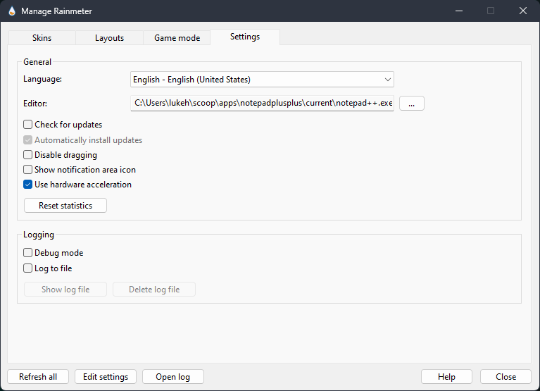

# Windows NT Customization 🎨
<p align="center">
  
</p>
<p align="center">
  <a href="https://dev.to/LukeHjo">
    
  </a>
  <a href="https://github.com/luke-beep">
    
  </a>
  <a href="https://mastodon.social/@lukehjo">
    
  </a>
  <a href="https://twitter.com/LuckyLukeHjo">
    
  </a>
  <a href="https://www.youtube.com/@LukeHjo">
    
  </a>
  <a href="https://hashnode.com/@LukeHjo">
    
  </a>
  <a href="https://lukehjo.dev">
    
  </a>
  <a href="https://tech.lukehjo.dev">
    
  </a>
  <a href="https://gist.github.com/luke-beep">
        
  </a>
</p>

## 🚀 Quick Navigation

- [Windows NT Customization 🎨](#windows-nt-customization-)
  - [🚀 Quick Navigation](#-quick-navigation)
  - [📸 Screenshots](#-screenshots)
  - [💻 Getting Started](#-getting-started)
    - [🎨 Desktop Customization](#-desktop-customization)
      - [📝 Prerequisites](#-prerequisites)
      - [🛠️ Configuration](#️-configuration)
    - [👨‍💻 Shell Configuration](#-shell-configuration)
      - [📝 Prerequisites](#-prerequisites-1)
      - [🛠️ Configuration](#️-configuration-1)
    - [💡 Miscellaneous Configuration](#-miscellaneous-configuration)
      - [📝 Prerequisites](#-prerequisites-2)
      - [🛠️ Configuration](#️-configuration-2)

## 📸 Screenshots


## 💻 Getting Started

> [!IMPORTANT]
> This guide is a work in progress and will be updated as I continue to customize my Windows NT system. This guide is not a step-by-step installation guide, but rather a list of the software and configurations I use to customize my system. It does not cover the installation of Windows NT, but rather the customization of an existing installation. It does not cover every single application and configuration, but rather the most important ones.

### 🎨 Desktop Customization

#### 📝 Prerequisites

- [Download Rainmeter](https://www.rainmeter.net/)
- [Download Droptop](https://droptopfour.com/)
- [Download Jaxcore](https://jaxcore.app/)
- [Download MicaForEveryone](https://github.com/MicaForEveryone/MicaForEveryone)
- [Download WinPaletter](https://github.com/Abdelrhman-AK/WinPaletter/releases)
- [Download Wallpaper Engine](https://www.wallpaperengine.io/en)

#### 🛠️ Configuration

Once you have installed the necessary software, you can begin customizing your desktop. Here's a list of the software and their respective configurations:

- **Rainmeter**: Once installed you can configure the Rainmeter skins by right-clicking on the Rainmeter icon in the system tray and selecting `Manage`. This will open the Rainmeter manager where you can select and configure the skins you have installed. Configure Rainmeter using the following settings, replace the editor with your preferred text editor:



- **Droptop**: Once installed you can configure Droptop by left-clicking on the Droptop icon in the system waybar and selecting `Droptop settings`. This will open the Droptop settings where you can configure the proper settings. Configure Droptop using the following settings:

| Setting                         | Value                                 |
| ---                             | ---                                   |
| Theme                           | Transparent                           |
| Color & opacity                 | Set color by desktop wallpaper        |
| Options -> Change Mode          | Only show on the Desktop              | 
| Options -> Adjust size settings | Mini 4                                |
| Options -> Menu options         | Show extra buttons in folder          |
| Options -> Menu options         | Fade effect when opening menu         |
| Options -> Menu options         | Simplified home menu                  |
| Options -> Font -> Change Font  | Urbanist                              |
| Options -> Shape                | Rounded top bar corners               |
| Options -> Shape                | Rounded menu corners                  |
| Options -> Shape                | Skew top bar shape                    |
| Options -> Shape                | Skew menu shape                       |
| Options -> Blur effects         | Dropdown menu blur                    |
| Options -> Blur effects         | Use heavy blur effect                 |
| Options -> Shadows              | Top bar text shadows                  |
| Options -> Shadows              | Dropdown text shadows                 |
| Options -> Advanced             | Disable DPI Scaling                   |
| Options -> More options         | Show song title on top bar            |

> [!NOTE]
> Settings not mentioned should be left as default or configured to your preference.

- **Jaxcore**: Once installed you can configure Jaxcore by searching for `Jaxcore` in the start menu and opening the Jaxcore settings. This will open the Jaxcore settings where you can configure the modules you have installed. Install the following modules:
    - ModularClocks
    - ModularPlayers

> [!NOTE]
> Once installed, you can configure these modules by going to your Jaxcore library. 

- Configure Jaxcore through Jaxcore Settings using the following settings:


- Next up is the configuration of the `ModularClocks` module. This module is a clock that can be configured to display the time in different formats. You can configure the `ModularClocks` module by right-clicking on the clock and selecting `Settings`. This will open the `ModularClocks` settings where you can configure the clock to your preference. Configure `ModularClocks` using the following settings:


Next up is the configuration of the `ModularPlayers` module. This module is a music player that can be configured to display the current song playing. You can configure the `ModularPlayers` module by right-clicking on the player and selecting `Settings`. This will open the `ModularPlayers` settings where you can configure the player to your preference. Configure `ModularPlayers` using the following settings:

> [!IMPORTANT]  
> The currently selected player style here is the Windows 11 one, the song that is currently playing `Kiss Me`, by `lamalex`.


> [!IMPORTANT]
> Spicetify must be installed and configured for the `ModularPlayers` module to work properly. The `ModularPlayers` module will not work without Spicetify installed and configured.


> [!TIP]
> Colors: (46, 52, 64) and alpha 25, then (46, 52, 64) and alpha 50.


- **MicaForEveryone**: Once installed you can configure MicaForEveryone by right-clicking on the MicaForEveryone icon in the system tray and selecting `Settings`. Now open your MicaForEveryone configuration file and paste in the following:

```conf
# Mica For Everyone Configuration

Global {
  TitleBarColor = Dark
  BackdropPreference = Mica
  CornerPreference = Rounded
  ExtendFrameIntoClientArea = False
  EnableBlurBehind = False
}

# Don't touch explorer and mspaint
Process: "explorer" {
  TitleBarColor = Dark
  BackdropPreference = Mica
  CornerPreference = Rounded
  ExtendFrameIntoClientArea = False
  EnableBlurBehind = False
}
Process: "mspaint" {
  TitleBarColor = Dark
  BackdropPreference = Mica
  CornerPreference = Rounded
  ExtendFrameIntoClientArea = False
  EnableBlurBehind = False
}

# Apply Mica background to Console Host window
Class: "ConsoleWindowClass" {
  TitleBarColor = Dark
  BackdropPreference = Mica
  CornerPreference = Rounded
  ExtendFrameIntoClientArea = True
  EnableBlurBehind = False
}
```

- **WinPaletter**: Once downloaded, you can configure WinPaletter by opening the WinPaletter settings. This will open the WinPaletter settings where you can configure the color palette to your preference. Configure WinPaletter using the following settings:


Alternatively you can import the following [theme file](configs/Azrael.wpth).

- **Wallpaper Engine**: Once installed you can configure Wallpaper Engine by right-clicking on the Wallpaper Engine icon in the system tray and selecting `Settings`. This will open the Wallpaper Engine settings where you can configure the wallpaper to your preference. Configure Wallpaper Engine using the following settings:


With these settings applied, you can download the following [wallpaper](https://steamcommunity.com/sharedfiles/filedetails/?id=2913091682) and set it as your desktop background.

### 👨‍💻 Shell Configuration

#### 📝 Prerequisites

- [Download NeoVim](https://www.lazyvim.org/)
- [Download my Shell Configuration](https://github.com/luke-beep/shell-config)
- [Download my NeoVim Configuration](https://github.com/luke-beep/nvim-config)

#### 🛠️ Configuration

Once you have installed the necessary software, you can begin customizing your shell. This won't be a step-by-step guide, but rather a list of the software and configurations.

### 💡 Miscellaneous Configuration

#### 📝 Prerequisites

- [Download Nord for Firefox](https://addons.mozilla.org/en-US/firefox/addon/nord-for-gecko/)
- [Download Nord for Chrome](https://chromewebstore.google.com/detail/nord-theme/dhlnjfhjjbminbjbegeiijdakdkamjoi)
- [Download Nord for Vivaldi](https://themes.vivaldi.net/themes/wOkJywOVlmd)
- [Download System Informer](https://www.systeminformer.com/)
- [Download Spicetify](https://github.com/spicetify/spicetify-cli)
- [Download PowerToys](https://github.com/microsoft/PowerToys)

#### 🛠️ Configuration

Once you have installed the necessary software, you can begin customizing your system. There won't be a step-by-step guide for each individual software.

- **Nord for Firefox**: Once installed you can continue using Firefox as you normally would, but with the Nord theme applied.
- **Nord for Chrome**: Once installed you can continue using Chrome as you normally would, but with the Nord theme applied.
- **Nord for Vivaldi**: Once installed you can continue using Vivaldi as you normally would, but with the Nord theme applied.
- **System Informer**: Once installed you can configure System Informer by right-clicking on the System Informer icon in the system tray and selecting `Settings`. This will open the System Informer settings where you can configure the system information to your preference. Replace the default task manager with System Informer by ticking the following option:


- **Spicetify**: Once installed you can configure Spicetify by opening a Pwsh/PowerShell instance and running the following [command](https://github.com/spicetify/spicetify-marketplace/wiki/Installation):

```pwsh
Invoke-WebRequest -UseBasicParsing "https://raw.githubusercontent.com/spicetify/spicetify-marketplace/main/resources/install.ps1" | Invoke-Expression
```

- Once installed, you can configure Spicetify to your likings with the Marketplace themes and extensions. I'm personally using the following themes and extensions:

| Theme / Extension       | 
| ---                     |
| Comfy                   |
| WikiFy                  |
| Beautiful Lyrics        |
| Spicetify-Hide-Podcasts |
| Spotify Genres          |

- **PowerToys**: Once installed you can configure PowerToys by right-clicking on the PowerToys icon in the system tray and selecting `Settings`. This will open the PowerToys settings where you can configure the system information to your preference. I'm personally using the following modules:

| Module                |
| ---                   |
| Color Picker          |
| Crop And Lock         |
| Environment Variables |
| File Locksmith        |
| Host File Editor      |
| Peek                  |
| Registry Preview      |
| PowerRename           |
| Image Resizer         |
| PowerToys Run         |

---

<p align="center">
  
</p>

**<div align="center" id="footer">© 2024 LukeHjo. All rights reserved. <div>**
<br>
<div align="right"><a href="#">(Back to top)</a></div>
